# BESS sweep results

Everything is relative. Market metrics are an index with the same arm's no-battery mean set to 100; effects are percent of that mean. Battery profit is per MW installed, as a yield: the percent of what 1 MW sold flat all day would earn at the no-battery mean price. Absolute values stay in results.csv and paired_effects.csv.

## Pretraining

Generators are trained alone first. Policy change is the mean absolute change of their deterministic bid schedule (actions in [-1, 1]) between the last two rounds.

| Seed | Policy change per round | Converged |
|---|---|---|
| 42 | 0.659, 0.264, 0.221, 0.176, 0.129, 0.112, 0.141, 0.138, 0.161, 0.194, 0.160, 0.127, 0.108, 0.152, 0.134, 0.144, 0.101, 0.115, 0.101 | True |
| 43 | 0.719, 0.339, 0.247, 0.241, 0.196, 0.170, 0.136, 0.071, 0.120, 0.139, 0.137, 0.084, 0.078, 0.056, 0.098, 0.120, 0.105, 0.105, 0.069 | True |
| 44 | 0.675, 0.254, 0.236, 0.233, 0.156, 0.178, 0.205, 0.153, 0.114, 0.123, 0.124, 0.120, 0.148, 0.081, 0.066, 0.058, 0.115, 0.109, 0.124 | True |
| 45 | 0.744, 0.329, 0.217, 0.302, 0.279, 0.270, 0.243, 0.146, 0.138, 0.218, 0.140, 0.075, 0.104, 0.080, 0.091, 0.133, 0.128, 0.144, 0.094 | True |
| 46 | 0.649, 0.229, 0.249, 0.233, 0.230, 0.163, 0.134, 0.164, 0.112, 0.117, 0.169, 0.103, 0.117, 0.128, 0.094, 0.088, 0.132, 0.101, 0.103 | True |
| 47 | 0.607, 0.245, 0.224, 0.184, 0.176, 0.145, 0.121, 0.079, 0.094, 0.115, 0.185, 0.165, 0.149, 0.131, 0.101, 0.088, 0.090, 0.101, 0.088 | True |
| 48 | 0.672, 0.278, 0.253, 0.287, 0.186, 0.173, 0.195, 0.220, 0.257, 0.192, 0.127, 0.122, 0.119, 0.131, 0.095, 0.111, 0.120, 0.134, 0.074 | True |
| 49 | 0.671, 0.203, 0.193, 0.177, 0.223, 0.162, 0.162, 0.140, 0.146, 0.123, 0.083, 0.055, 0.070, 0.126, 0.147, 0.103, 0.082, 0.119, 0.159 | False |
| 50 | 0.696, 0.246, 0.264, 0.240, 0.230, 0.213, 0.159, 0.212, 0.136, 0.101, 0.068, 0.160, 0.134, 0.096, 0.130, 0.139, 0.173, 0.137, 0.094 | True |
| 51 | 0.575, 0.242, 0.191, 0.294, 0.219, 0.207, 0.158, 0.179, 0.167, 0.139, 0.096, 0.083, 0.114, 0.128, 0.142, 0.152, 0.158, 0.110, 0.082 | True |

## Arm: frozen

Index (no battery = 100), mean over seeds (± std across seeds). Per-config values are averages over the evaluation demand episodes. Loss-of-load figures are in results.csv.

| Power (MW) | Duration (h) | Seeds | Mean price | Price std | Daily spread | Consumer cost | Gen profit | BESS profit per MW (%) | BESS cycles |
|---|---|---|---|---|---|---|---|---|---|
| none | – | 10 | 100.00 ± 4.38 | 100.00 ± 20.99 | 100.00 ± 21.59 | 100.00 ± 4.23 | 100.00 ± 8.33 | – | – |
| 5 | 1 | 10 | 99.92 ± 4.31 | 99.17 ± 20.30 | 98.90 ± 20.73 | 99.86 ± 4.12 | 98.69 ± 8.42 | 9.15 ± 2.67 | 2.86 ± 0.86 |
| 5 | 2 | 10 | 99.86 ± 4.27 | 99.18 ± 20.21 | 98.96 ± 20.62 | 99.76 ± 4.06 | 98.42 ± 8.38 | 9.32 ± 3.34 | 1.73 ± 0.52 |
| 5 | 4 | 10 | 99.78 ± 4.26 | 99.14 ± 20.13 | 98.97 ± 20.60 | 99.63 ± 4.18 | 97.97 ± 8.57 | 11.27 ± 3.35 | 0.95 ± 0.21 |
| 5 | 8 | 10 | 99.74 ± 4.11 | 98.81 ± 19.73 | 99.35 ± 19.98 | 99.54 ± 3.92 | 97.61 ± 8.30 | 11.63 ± 3.40 | 0.63 ± 0.12 |
| 10 | 1 | 10 | 99.74 ± 4.35 | 98.98 ± 19.85 | 98.92 ± 20.20 | 99.69 ± 4.04 | 97.51 ± 8.51 | 8.54 ± 2.49 | 3.09 ± 0.77 |
| 10 | 2 | 10 | 100.09 ± 4.20 | 98.35 ± 20.50 | 98.67 ± 20.70 | 100.02 ± 4.07 | 98.02 ± 8.72 | 8.26 ± 2.92 | 1.67 ± 0.48 |
| 10 | 4 | 10 | 99.88 ± 4.19 | 98.77 ± 19.94 | 98.89 ± 20.57 | 99.78 ± 3.98 | 97.19 ± 8.73 | 10.25 ± 3.43 | 0.94 ± 0.22 |
| 10 | 8 | 10 | 99.85 ± 4.01 | 98.91 ± 19.58 | 99.33 ± 19.47 | 99.59 ± 3.76 | 96.52 ± 8.71 | 10.78 ± 4.25 | 0.61 ± 0.15 |
| 25 | 1 | 10 | 99.70 ± 3.98 | 98.19 ± 19.82 | 96.76 ± 19.96 | 99.77 ± 3.93 | 96.23 ± 8.95 | 5.91 ± 2.34 | 2.62 ± 1.01 |
| 25 | 2 | 10 | 99.24 ± 4.14 | 97.55 ± 20.23 | 96.45 ± 19.66 | 99.08 ± 3.98 | 94.87 ± 9.47 | 5.54 ± 2.69 | 1.59 ± 0.48 |
| 25 | 4 | 10 | 98.34 ± 4.54 | 99.39 ± 18.80 | 97.16 ± 18.02 | 97.59 ± 4.53 | 92.38 ± 10.36 | 5.31 ± 3.45 | 0.81 ± 0.19 |
| 25 | 8 | 10 | 98.28 ± 4.73 | 98.60 ± 21.34 | 96.01 ± 19.38 | 97.20 ± 4.69 | 91.57 ± 10.48 | 5.22 ± 2.35 | 0.49 ± 0.07 |
| 50 | 1 | 10 | 98.57 ± 4.48 | 99.94 ± 19.31 | 96.20 ± 17.31 | 98.28 ± 4.62 | 92.37 ± 11.21 | 3.78 ± 2.08 | 1.69 ± 0.77 |
| 50 | 2 | 10 | 98.54 ± 4.48 | 99.18 ± 20.32 | 95.04 ± 19.39 | 98.25 ± 4.58 | 92.98 ± 12.18 | 3.12 ± 2.88 | 0.91 ± 0.35 |
| 50 | 4 | 10 | 99.20 ± 4.25 | 96.52 ± 20.32 | 92.89 ± 17.64 | 98.70 ± 4.22 | 93.01 ± 11.84 | 4.13 ± 2.83 | 0.48 ± 0.11 |
| 50 | 8 | 10 | 99.25 ± 4.09 | 96.18 ± 19.32 | 93.85 ± 16.37 | 98.75 ± 4.15 | 93.46 ± 11.23 | 3.44 ± 2.48 | 0.21 ± 0.05 |
| 75 | 1 | 10 | 98.90 ± 4.49 | 98.48 ± 21.06 | 94.86 ± 18.57 | 98.59 ± 4.49 | 93.12 ± 10.42 | 2.23 ± 1.20 | 0.90 ± 0.31 |
| 75 | 2 | 10 | 98.70 ± 5.17 | 98.30 ± 22.13 | 94.37 ± 20.73 | 98.19 ± 5.28 | 92.47 ± 12.09 | 2.60 ± 1.49 | 0.62 ± 0.15 |
| 75 | 4 | 10 | 99.58 ± 3.96 | 95.20 ± 20.62 | 92.49 ± 18.67 | 99.03 ± 3.98 | 93.78 ± 10.25 | 2.50 ± 1.51 | 0.32 ± 0.11 |
| 75 | 8 | 10 | 99.81 ± 4.37 | 95.87 ± 21.11 | 92.70 ± 20.91 | 99.40 ± 4.25 | 94.72 ± 10.38 | 2.35 ± 1.62 | 0.11 ± 0.05 |

### Paired effects (battery minus same-seed baseline)

Mean difference as percent of the no-battery mean, with a 95% bootstrap interval across seeds; * marks an interval that excludes zero.

| Power (MW) | Duration (h) | Seeds | Mean price | Price std | Daily spread | Consumer cost | Gen profit |
|---|---|---|---|---|---|---|---|
| 5 | 1 | 10 | -0.08% [-0.26, +0.08] | -0.83% [-1.74, +0.04] | -1.10% [-2.13, -0.23] * | -0.14% [-0.34, +0.02] | -1.31% [-1.69, -0.95] * |
| 5 | 2 | 10 | -0.14% [-0.48, +0.14] | -0.82% [-1.85, +0.18] | -1.04% [-2.12, -0.12] * | -0.24% [-0.66, +0.08] | -1.58% [-2.31, -0.95] * |
| 5 | 4 | 10 | -0.22% [-0.58, +0.10] | -0.86% [-2.05, +0.27] | -1.03% [-2.12, -0.10] * | -0.37% [-0.79, -0.01] * | -2.03% [-2.84, -1.30] * |
| 5 | 8 | 10 | -0.26% [-0.62, +0.08] | -1.19% [-2.42, +0.05] | -0.65% [-1.95, +0.63] | -0.46% [-0.88, -0.10] * | -2.39% [-3.03, -1.83] * |
| 10 | 1 | 10 | -0.26% [-0.76, +0.14] | -1.02% [-2.65, +0.66] | -1.08% [-2.40, +0.18] | -0.31% [-0.85, +0.12] | -2.49% [-3.50, -1.64] * |
| 10 | 2 | 10 | +0.09% [-0.08, +0.30] | -1.65% [-3.05, -0.43] * | -1.33% [-2.48, -0.34] * | +0.02% [-0.16, +0.24] | -1.98% [-2.47, -1.40] * |
| 10 | 4 | 10 | -0.12% [-0.57, +0.25] | -1.23% [-2.88, +0.47] | -1.11% [-2.38, +0.03] | -0.22% [-0.60, +0.12] | -2.81% [-3.51, -2.02] * |
| 10 | 8 | 10 | -0.15% [-0.47, +0.20] | -1.09% [-2.74, +0.47] | -0.67% [-2.30, +1.23] | -0.41% [-0.74, -0.06] * | -3.48% [-4.10, -2.84] * |
| 25 | 1 | 10 | -0.30% [-0.88, +0.26] | -1.81% [-3.75, -0.03] * | -3.24% [-5.45, -1.35] * | -0.23% [-0.79, +0.24] | -3.77% [-4.91, -2.69] * |
| 25 | 2 | 10 | -0.76% [-1.22, -0.35] * | -2.45% [-3.75, -1.21] * | -3.55% [-5.61, -1.84] * | -0.92% [-1.61, -0.34] * | -5.13% [-6.44, -3.91] * |
| 25 | 4 | 10 | -1.66% [-3.00, -0.45] * | -0.61% [-3.72, +3.35] | -2.84% [-6.56, +1.99] | -2.41% [-4.32, -0.81] * | -7.62% [-10.91, -4.79] * |
| 25 | 8 | 10 | -1.72% [-3.00, -0.57] * | -1.40% [-4.02, +1.06] | -3.99% [-6.75, -1.12] * | -2.80% [-4.77, -1.03] * | -8.43% [-12.21, -5.12] * |
| 50 | 1 | 10 | -1.43% [-2.06, -0.79] * | -0.06% [-2.56, +2.95] | -3.80% [-7.69, +0.53] | -1.72% [-2.35, -1.05] * | -7.63% [-10.14, -5.55] * |
| 50 | 2 | 10 | -1.46% [-2.32, -0.62] * | -0.82% [-3.23, +1.87] | -4.96% [-7.97, -1.92] * | -1.75% [-2.63, -0.93] * | -7.02% [-10.23, -4.15] * |
| 50 | 4 | 10 | -0.80% [-1.28, -0.32] * | -3.48% [-5.79, -1.45] * | -7.11% [-10.87, -3.45] * | -1.30% [-1.90, -0.75] * | -6.99% [-9.73, -4.37] * |
| 50 | 8 | 10 | -0.75% [-1.23, -0.27] * | -3.82% [-6.28, -1.57] * | -6.15% [-10.21, -2.11] * | -1.25% [-1.78, -0.75] * | -6.54% [-8.69, -4.47] * |
| 75 | 1 | 10 | -1.10% [-1.73, -0.48] * | -1.52% [-3.51, +0.68] | -5.14% [-8.16, -2.14] * | -1.41% [-2.14, -0.75] * | -6.88% [-8.59, -5.23] * |
| 75 | 2 | 10 | -1.30% [-2.68, -0.28] * | -1.70% [-3.68, +0.30] | -5.63% [-9.31, -2.38] * | -1.81% [-3.23, -0.70] * | -7.53% [-10.72, -4.91] * |
| 75 | 4 | 10 | -0.42% [-0.83, -0.03] * | -4.80% [-7.46, -2.69] * | -7.51% [-11.41, -3.65] * | -0.97% [-1.54, -0.45] * | -6.22% [-7.88, -4.57] * |
| 75 | 8 | 10 | -0.19% [-0.55, +0.15] | -4.13% [-6.08, -2.31] * | -7.30% [-11.01, -3.67] * | -0.60% [-1.05, -0.22] * | -5.28% [-7.14, -3.45] * |

### Batteries below 0.6 equivalent cycles (73 of 200)

p10_d4_s42, p10_d8_s42, p10_d8_s46, p10_d8_s47, p10_d8_s50, p25_d1_s42, p25_d4_s42, p25_d4_s44, p25_d8_s42, p25_d8_s43, p25_d8_s44, p25_d8_s45, p25_d8_s46, p25_d8_s47, p25_d8_s48, p25_d8_s49, p25_d8_s50, p25_d8_s51, p50_d1_s42, p50_d2_s42, p50_d2_s45, p50_d2_s50, p50_d4_s42, p50_d4_s43, p50_d4_s44, p50_d4_s45, p50_d4_s46, p50_d4_s47, p50_d4_s48, p50_d4_s50, p50_d4_s51, p50_d8_s42, p50_d8_s43, p50_d8_s44, p50_d8_s45, p50_d8_s46, p50_d8_s47, p50_d8_s48, p50_d8_s49, p50_d8_s50, p50_d8_s51, p5_d4_s42, p5_d8_s42, p5_d8_s47, p5_d8_s49, p75_d1_s42, p75_d1_s48, p75_d2_s42, p75_d2_s43, p75_d2_s45, p75_d2_s46, p75_d2_s48, p75_d2_s50, p75_d4_s42, p75_d4_s43, p75_d4_s44, p75_d4_s45, p75_d4_s46, p75_d4_s47, p75_d4_s48, p75_d4_s49, p75_d4_s50, p75_d4_s51, p75_d8_s42, p75_d8_s43, p75_d8_s44, p75_d8_s45, p75_d8_s46, p75_d8_s47, p75_d8_s48, p75_d8_s49, p75_d8_s50, p75_d8_s51

### Paired effects excluding those batteries

| Power (MW) | Duration (h) | Seeds | Mean price | Price std | Daily spread | Consumer cost | Gen profit |
|---|---|---|---|---|---|---|---|
| 5 | 1 | 10 | -0.08% [-0.26, +0.08] | -0.83% [-1.74, +0.04] | -1.10% [-2.13, -0.23] * | -0.14% [-0.34, +0.02] | -1.31% [-1.69, -0.95] * |
| 5 | 2 | 10 | -0.14% [-0.48, +0.14] | -0.82% [-1.85, +0.18] | -1.04% [-2.12, -0.12] * | -0.24% [-0.66, +0.08] | -1.58% [-2.31, -0.95] * |
| 5 | 4 | 9 | -0.25% [-0.64, +0.12] | -0.91% [-2.17, +0.30] | -1.10% [-2.24, -0.10] * | -0.42% [-0.88, -0.00] * | -2.26% [-3.05, -1.54] * |
| 5 | 8 | 7 | -0.34% [-0.80, +0.13] | -1.14% [-2.59, +0.29] | -1.00% [-2.50, +0.37] | -0.57% [-1.12, -0.08] * | -2.88% [-3.62, -2.23] * |
| 10 | 1 | 10 | -0.26% [-0.76, +0.14] | -1.02% [-2.65, +0.66] | -1.08% [-2.40, +0.18] | -0.31% [-0.85, +0.12] | -2.49% [-3.50, -1.64] * |
| 10 | 2 | 10 | +0.09% [-0.08, +0.30] | -1.65% [-3.05, -0.43] * | -1.33% [-2.48, -0.34] * | +0.02% [-0.16, +0.24] | -1.98% [-2.47, -1.40] * |
| 10 | 4 | 9 | -0.15% [-0.66, +0.27] | -1.29% [-3.04, +0.52] | -1.18% [-2.50, +0.02] | -0.25% [-0.68, +0.13] | -3.15% [-3.73, -2.57] * |
| 10 | 8 | 6 | +0.06% [-0.39, +0.52] | -1.55% [-2.59, -0.53] * | -1.78% [-3.27, -0.32] * | -0.17% [-0.59, +0.24] | -4.22% [-4.93, -3.70] * |
| 25 | 1 | 9 | -0.34% [-0.98, +0.29] | -1.92% [-3.94, -0.06] * | -3.44% [-5.68, -1.56] * | -0.26% [-0.87, +0.28] | -4.14% [-5.28, -3.10] * |
| 25 | 2 | 10 | -0.76% [-1.22, -0.35] * | -2.45% [-3.75, -1.21] * | -3.55% [-5.61, -1.84] * | -0.92% [-1.61, -0.34] * | -5.13% [-6.44, -3.91] * |
| 25 | 4 | 8 | -1.95% [-3.56, -0.46] * | +0.46% [-3.02, +4.98] | -1.38% [-5.30, +4.05] | -2.75% [-5.07, -0.74] * | -8.40% [-12.32, -5.05] * |
| 50 | 1 | 9 | -1.55% [-2.22, -0.88] * | +0.09% [-2.58, +3.28] | -4.03% [-8.06, +0.54] | -1.85% [-2.53, -1.15] * | -8.27% [-10.78, -6.21] * |
| 50 | 2 | 7 | -1.90% [-2.89, -0.84] * | +0.69% [-2.17, +3.55] | -4.38% [-8.43, -0.40] * | -2.06% [-3.17, -0.97] * | -8.72% [-12.65, -4.90] * |
| 50 | 4 | 1 | -1.56% | +0.67% | -1.08% | -2.07% | -12.54% |
| 75 | 1 | 8 | -1.02% [-1.74, -0.29] * | -1.61% [-3.77, +0.82] | -5.86% [-8.80, -2.78] * | -1.21% [-1.92, -0.55] * | -7.25% [-9.30, -5.25] * |
| 75 | 2 | 4 | -2.75% [-5.52, -0.85] * | -0.24% [-2.96, +2.48] | -7.44% [-13.17, -1.71] * | -3.28% [-5.99, -1.25] * | -11.39% [-17.33, -5.43] * |

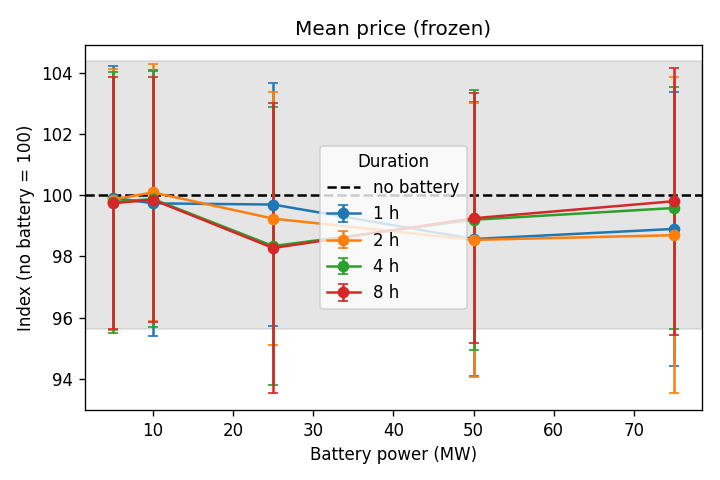
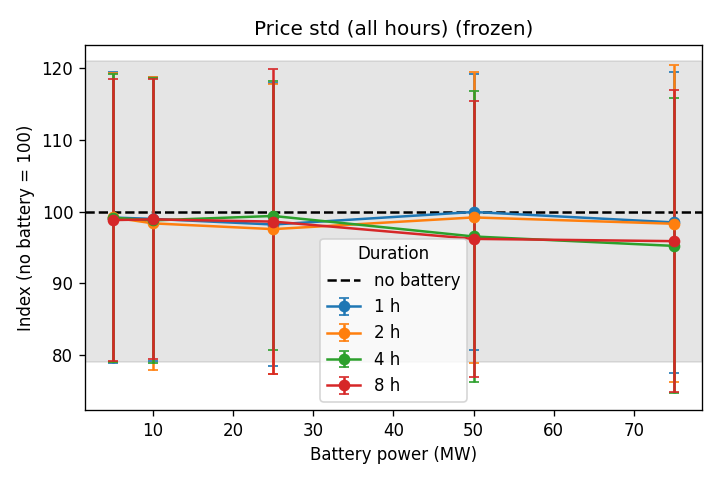
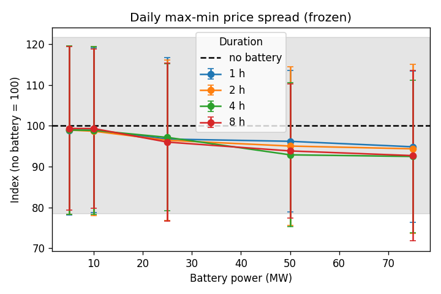
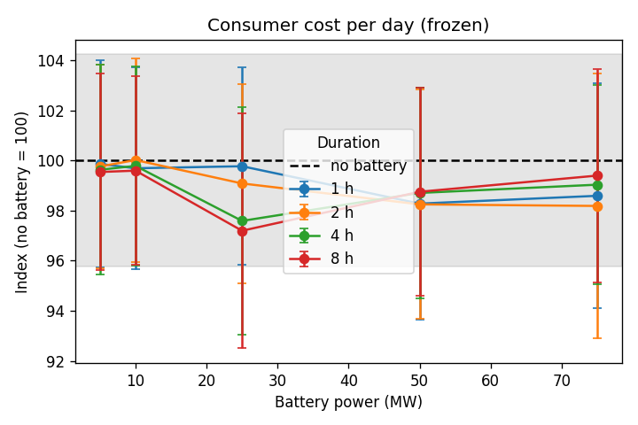
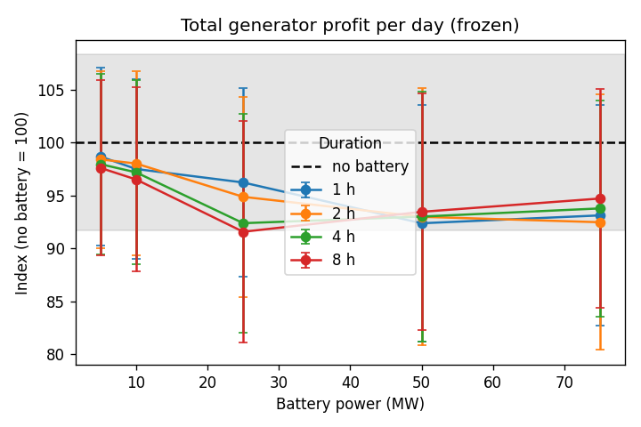
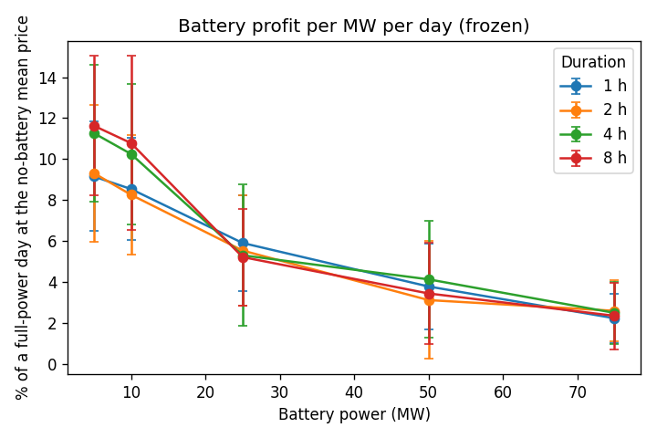
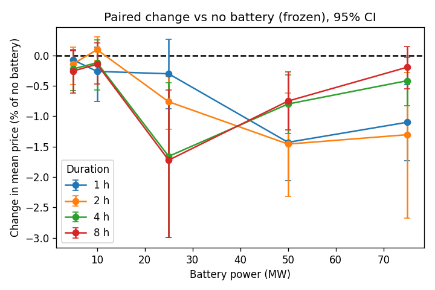
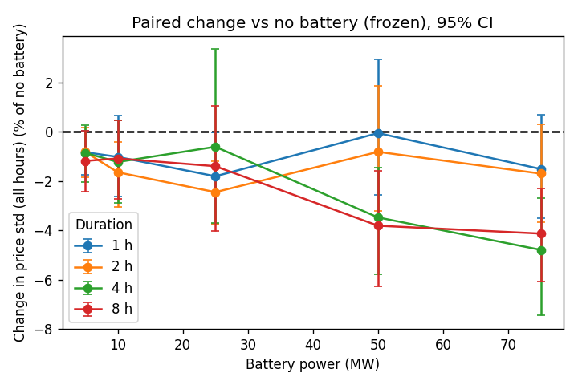
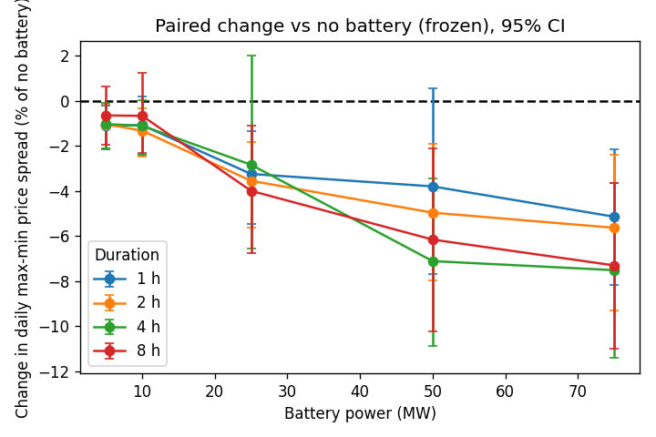
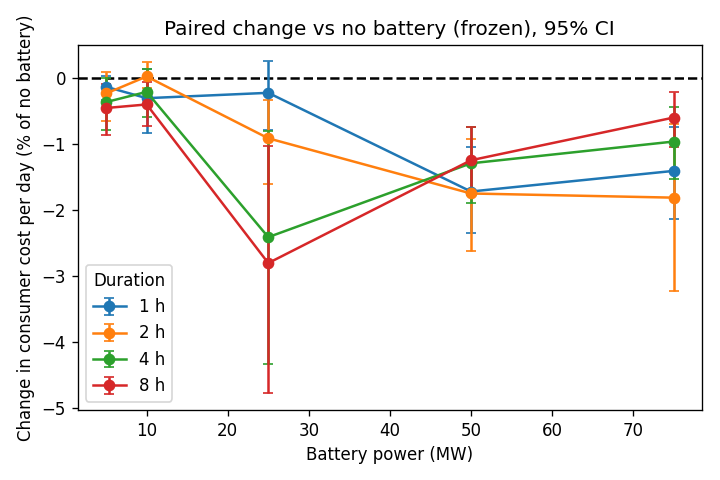
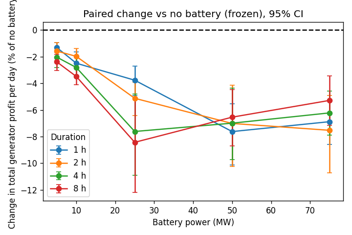

